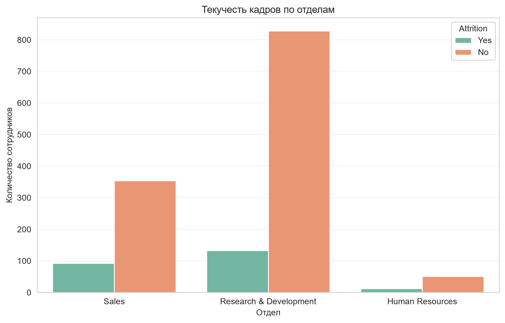
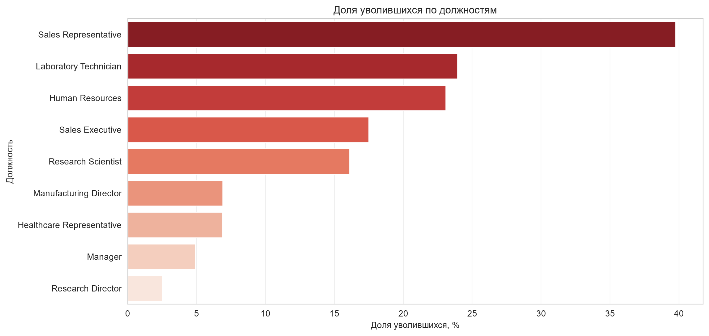
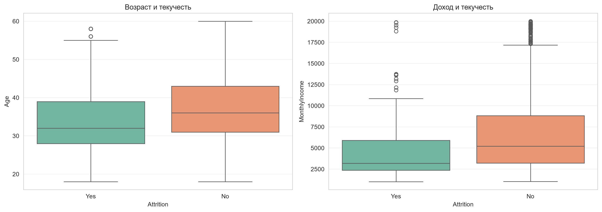
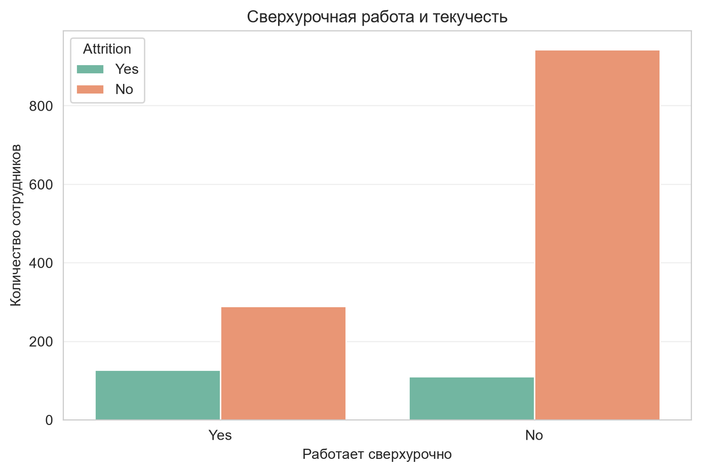
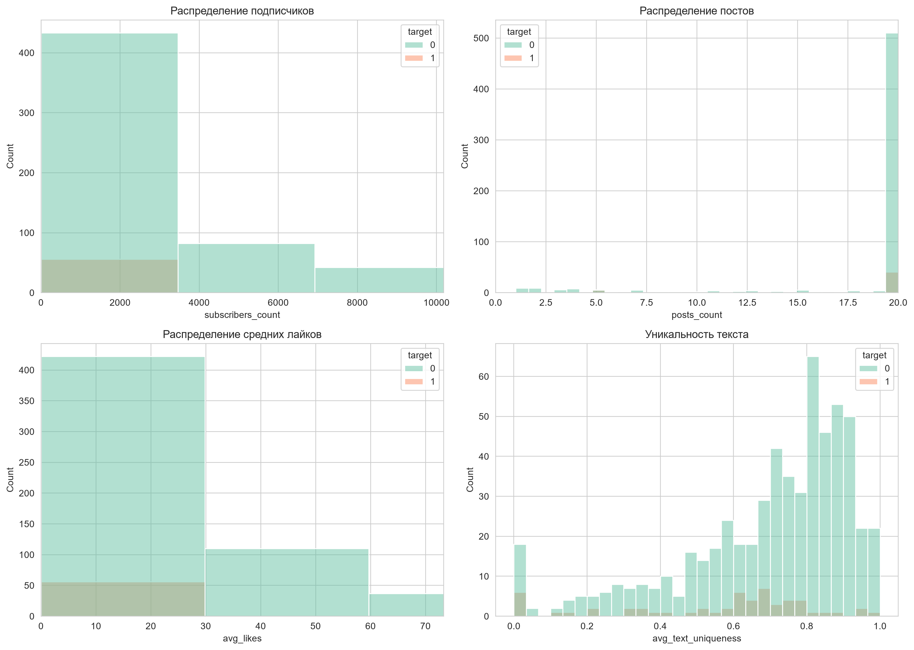
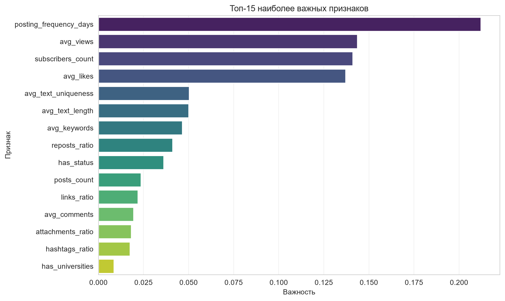
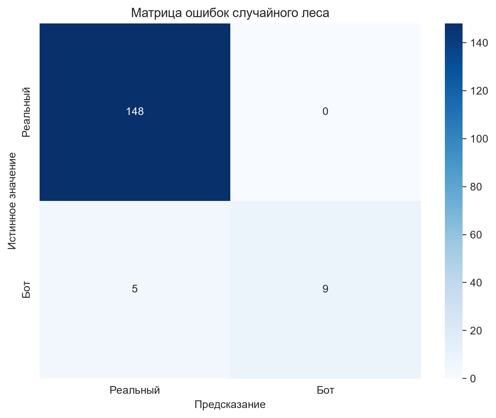
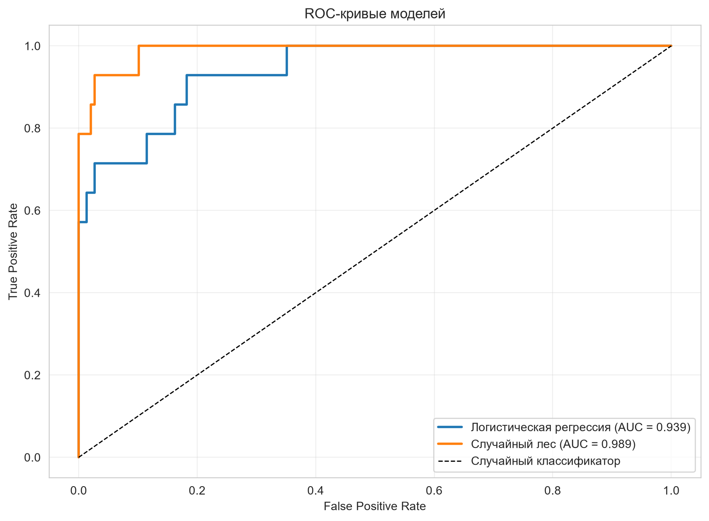

# Аналитика больших данных в Google Colab

Курсовые работы по дисциплине «Технология разработки больших данных».

## О репозитории

В репозитории два независимых проекта, объединённых общей темой
разведочного анализа данных и применения методов машинного обучения.
Оба выполнены на Python и воспроизводимы в среде Google Colab или
Jupyter Notebook.

## HR-аналитика

### Задача

Проанализировать данные о сотрудниках вымышленной организации и
выявить факторы, связанные с текучестью кадров. Результаты
предназначены для отдела управления персоналом и должны дать
основания для корректировки политики удержания.

### Исходные данные

Датасет IBM HR Analytics Employee Attrition содержит 1470 записей
о сотрудниках и 35 переменных: демографические характеристики,
параметры должности, уровень дохода, оценки удовлетворённости,
стаж и факт увольнения. Данные синтетические, созданы специалистами
IBM для учебных и демонстрационных целей. Файл лежит в
`hr-analytics/data/ibm_hr_attrition.csv`.

### Методология

Анализ включает общую характеристику датасета, распределение
текучести по отделам и должностям, сравнение уволившихся и
оставшихся сотрудников по возрасту, доходу и стажу, а также
корреляционный анализ числовых признаков с фактом увольнения.
Визуализация выполнена через seaborn и matplotlib.

### Результаты

Доля уволившихся сотрудников составляет 16.1 процента. Наибольшая
текучесть наблюдается в отделе продаж и на позициях Sales
Representative. Уволившиеся в среднем моложе и получают меньший
доход, чем оставшиеся. Корреляционный анализ показывает, что
с фактом увольнения положительно связаны сверхурочная работа и
частота смены компаний, отрицательно — стаж в компании, уровень
должности и удовлетворённость работой.

### Стек

Python, pandas, numpy, seaborn, matplotlib.

## Анализ социальных сетей

### Задача

Построить модель, которая по характеристикам профиля социальной
сети определяет, является ли аккаунт ботом или реальным
пользователем. Такая модель применяется службами безопасности
платформ для выявления автоматизированной активности и
фальшивых аккаунтов.

### Исходные данные

Датасет содержит 5874 профиля ВКонтакте и 60 признаков: количество
подписчиков, постов, средние метрики лайков и комментариев, частоту
публикаций, долю ссылок, хэштегов и рекламы, характеристики
уникальности текста, а также бинарные признаки оформления профиля.
Целевая переменная `target` принимает значение 0 для реальных
пользователей и 1 для ботов. Классы сбалансированы.

### Методология

Отобраны информативные числовые и бинарные признаки. Данные
разделены на обучающую и тестовую выборки в пропорции 75 к 25
со стратификацией по целевой переменной. Числовые признаки
нормализованы через StandardScaler. Обучены две модели:
логистическая регрессия и случайный лес. Качество оценено
через accuracy, ROC AUC, матрицу ошибок и ROC-кривые.
Дополнительно рассчитана важность признаков.

### Результаты

Обе модели показали высокое качество. Случайный лес достиг
ROC AUC около 0.99 и accuracy около 0.97. Логистическая регрессия
незначительно уступает, но также работает устойчиво. Наиболее
важными признаками для детекции ботов оказались наличие статуса,
средняя длина текста, доля ссылок и уникальность текста. Это
согласуется с известными признаками автоматизированного поведения:
боты обычно публикуют короткие или шаблонные тексты с большим
числом ссылок.

### Стек

Python, pandas, numpy, scikit-learn, seaborn, matplotlib.

## Запуск

Установите зависимости:

    pip install -r requirements.txt

### HR-аналитика

    cd hr-analytics
    jupyter notebook hr_analytics.ipynb

### Анализ социальных сетей

    cd social-network-analysis
    jupyter notebook social_network_analysis.ipynb

Ноутбуки также можно открыть в Google Colab, загрузив их через
интерфейс платформы.